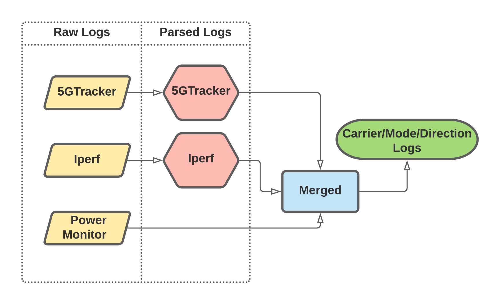

(Can be updated)
# MN Power Walking Loops

This folder contains the dataset, processing and modeling scripts for walking loops conducted using **5GTracker** and Monsoon Power Monitor at UMN. It covers power modeling results presented in Section 4.4 of the paper. All the power related tests were conducted using Samsung S20U on MN side. Data was collected for two carriers (Verizon and T-Mobile).


## Folder Structure
The flow diagram below gives a brief overview of steps performed to generate data for MN Power Wild experiments.



Each walking loop can be uniquely identified using `Iperf Run Number`. Note that each iperf run will be mapped to a single 5GTracker session.

| Filename | Description |
|----------|-------------|
|`data/MN-Power-Wild-Summary.csv`|Summary file containing description for all the runs done|
|`data/Towers.csv`|Location information for all 5G towers in loop
|`data/client/[Device ID]-[5GTracker Session ID]-01.csv`|Raw session logs collected using 5GTracker|
|`data/client/[Device ID]-run[Iperf Run Number]-iPerf.txt`|Raw Iperf logs collected using 5GTracker|
|`data/baseline/base[Iperf Run Number].csv`|Baseline power collected using Monsoon Power Monitor|
|`data/power/run[Iperf Run Number].csv`|Raw power logs collected using Monsoon Power Monitor|
|`data-processed/iperf-logs/[Device ID]-run[Iperf Run Number].csv`|Processed iperf logs for each run|
|`data-processed/session-logs/[Device ID]-[5GTracker Session ID]-01.csv`|Processed 5GTracker logs for each run|
|`data-processed/merged-logs/[Device ID]-run[Iperf Run Number]`|Processed logs generated after merging processed iperf logs, processed 5GTracker logs and raw power logs|
|`data-processed/MN-Power-Wild_combined.csv`|Combined file containing merged logs for all runs. See the [Dataset Description](#dataset-description) section for more details|
|`data-processed/cleaned-logs/[Model]_[Carrier]_[Network Type]_[Direction].csv`|Cleaned data for each Model [S20, S10], Carrier [Verizon, T-Mobile], Network Type [NSA+LTE, SA, mmWave] and Direction [uplink, downlink]| 
|`01-Process-Iperf-Logs.py`|Python script to process raw Iperf logs for each run|
|`02-Process-5GTracker-Logs.py`|Python script to process raw 5GTracker logs for each run|
|`03-Merge-Walking-Loops.py`|Python script to merge raw power logs, parsed 5GTracker logs and parsed Iperf logs for each run|
|`04-Combine-Walking-Loops.py`|Python script to generate combined merged file for all runs|
|`05-Prepare-Data-Modeling.py`|Python script to generate separate data files for each carrier/network/direction config|
|`06-DRT-Model.py`|Python script to generate results for the power model. See the [Generating Results](#generating-results) section for more details|

## Dataset Description
| Field Name | Description |
|-------------|-------------|
|`compassAccuracy`|Compass accuracy reported by Android API|
|`compassDirection`|Compass direction reported by Android API|
|`currentNow`|Current value exposed by sysfs interface (unit)|
|`latitude`|Latitude position of mobile device|
|`locationAccuracy`|Location accuracy reported by Android API|
|`longitude`|Longitude position of mobile device|
|`mCid`|The 36-bit NR Cell Identity in range (0, 68719476735)|
|`mobileRx`|Number of received bytes on cellular interface|
|`mobileTx`|Number of transmitted bytes on cellular interface|
|`movingSpeed`|Moving speed of the mobile device (unit)|
|`movingSpeedAccuracyMPS`|Moving speed accuracy reported by Android API|
|`nrStatus`|Mobile device connected to 5G NR or not|
|`nrStatus_array`|NR status sequence seen in each second|
|`nr_ssRsrp`|Max Reference Signal Received Power for current NR cell in each second (unit)|
|`nr_ssRsrp_avg`|Average Reference Signal Received Power for current NR cell in each second (unit)|
|`nr_ssSinr`|Max Signal to Interference & Noise Ratio for current NR cell in each second (unit)|
|`nr_ssSinr_avg`|Average Signal to Interference & Noise Ratio for current NR cell in each second (unit)|
|`rsrp`|Max Reference Signal Received Power for current LTE cell in each second (unit)|
|`rsrp_avg`|Average Reference Signal Received Power for current LTE cell in each second (unit)|
|`timestamp`|Timestamp for each data sample|
|`towerid`|Tower Id calculated using mCid|
|`voltageNow`|Voltage value exposed by sysfs interface (unit)|
|`downlink_mbps`|Downlink throughput observed (Mbps)|
|`uplink_mbps`|Uplink throughput observed (Mbps)|
|`sw_power`|Raw Power calculated using current and voltage values exposed by sysfs interface (unit)|
|`sw_power_rolled`|Power calculated using current and voltage values after with a rolling window (unit)|
|`sw_power_baseline`|Power calculated using current and voltage values after subtracting baseline power (unit)|
|`parent_file`|Parsed Iperf file used for generating each data sample|
|`protocol`|Protocol used for transferring data b/w mobile device and server (TCP, UDP)|
|`length`|Duration of iperf transfer (sec)|
|`Fixedtimestamp`|Timestamp calculated from Iperf logs|
|`_start`|relative start time of Iperf logging interval (sec)|
|`_end`|relative end time of Iperf logging interval (sec)|
|`conn_num`|Connection id during iperf data transfer (empty if average of all connections)|
|`Throughput`|Throughput seen during Iperf interval (Mbps)|
|`run_number`|Iperf run number for current data sample|
|`seq_no`|Sequence number of Iperf intervals|
|`time_since_start`|relative time since the start of an experiment (sec)|
|`avg_power`|Average power observed by Monsoon Power Monitor in each second (unit)|
|`avg_power_rolled`|Average power observed by Monsoon Power Monitor in each second after using a rolling window (unit)|
|`avg_power_baseline`|Average power observed by Monsoon Power Monitor after subtracting baseline power (unit)|
|`provider`|Service provider (Verizon, T-Mobile)|
|`network_type`|Network Type for each run (NSA+LTE, SA, mmWave)|
|`direction`|Direction of Iperf data transfer (Uplink, Downlink)|
|`trajectory`|Trajectory for each walking loop (clockwise, anti-clockwise)|


## Generating Results
The scripts will generate the data used for power model presented in section 4.4

### Requirements
Here are the software/package requirements. The version number in the bracket indicates the minimum version that our script has been tested on.

- Python 3 (3.7.7 and higher)
- Pandas (1.1.3 and higher)
- scikit-learn	(0.24.1 and higher)
- seaborn (0.11.1 and higher)

### Running code
The processed logs can be found in `data-processed` folder. 

Note that we have only put the experiment summary file `MN-Power-Wild-Summary.csv` in the data folder due to file size of raw logs. To regenerate complete logs, download the data from [google-drive](https://drive.google.com/drive/folders/1yxmJr3zl5dn81d1LLHwyOI--6l0hOcYE?usp=sharing) and put it in the `data` folder.

To regenerate the logs from scratch, the following commands can be used. 

```bash
python3 01-Process-Iperf-Logs.py && \
python3 02-Process-5GTracker-Logs.py && \
python3 03-Merge-Walking-Loops.py && \
python3 04-Combine-Walking-Loops.py && \
python3 05-Prepare-Data-Modeling.py
```

The processed logs will be placed in `data-processed` folder. The [Folder Structure](#folder-structure) section gives a detailed overview of all the files in `data-processed` folder.
